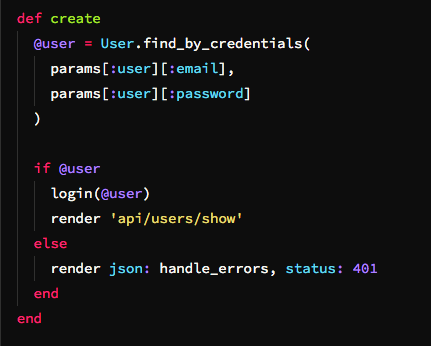
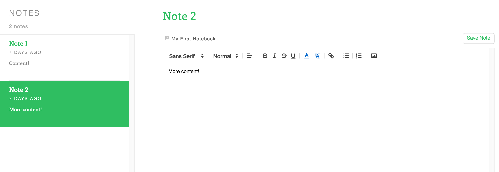
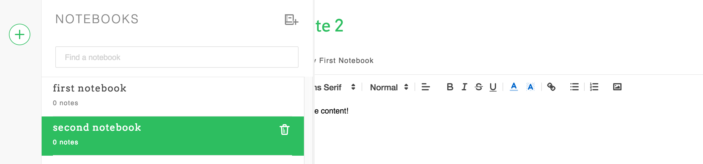
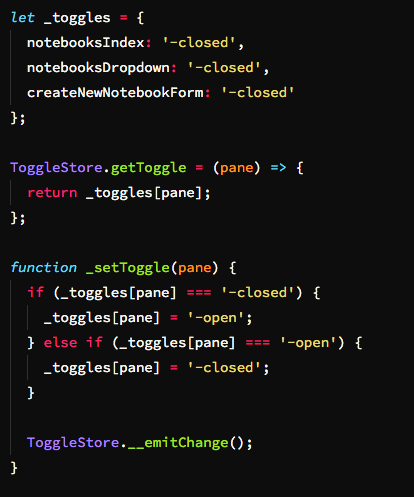

# SometimesNote

#### [SometimesNote](www.sometimes-note.herokuapp.com)

SometimesNote is a clone of Evernote and will attempt to emulate the core features of the web-app found at http://www.evernote.com. Built as a full-stack webapp using a Rails backend, Postgresql database, and React.js/Flux architecture for handling front-end UI.

## Features

### Single-Page App
The focus of this project was to create a completely 'Single Page App', handling all of the features in a single root '\
'. By doing so the app loads and runs with smooth operation and a more gratifying and seamless user experience. All components of the app are fully rendered at the initial client request and, though they may be hidden from view, are all operating and sharing information under the visible surface of the app.

### User Sessions
By keeping the user's private information (e.g. password, user data, etc.) in the backend it is kept safe from other users. Information is fetched from the backend through API calls to the SessionsController and UsersController. Only the necessary information is returned to the frontend using jBuilder, so the user's password is never exposed.

### Notes
  Notes are stored in the Postgresql database for easy retrieval through API calls. Notes are associated with Users and Notebooks using foreign keys in the notes table, allowing for easy organization of 'notes by user' when they're sent back to the frontend for rendering. When fetched from the backend they are kept in a frontend 'NotesStore' in a private variable to keep them out of the reach of malicious users. The flux loop then uses private functions that are closed over and utilized by the AppDispatcher to retrieve single notes or batches of notes using 'NotesActions'.

  ##### Notes Table
  | Note Info     | Data Type     |
  | ------------- |:-------------:|
  | id            | :integer      |
  | title         | :string       |
  | content       | :text         |
  | author_id     | :integer      |
  | notebook_id   | :integer      |
  | created_at    | :datetime     |
  | updated_at    | :boolean      |

  Notes are rendered in two separate components that must communicate with each other through their shared 'store'. They can occupy the 'NoteForm' or the 'NotesIndex'. The former gets a single note by id from the store and displays its full content in the editor. The NotesIndex lists all notes with a preview of their content as well as a timestamp (using moment.js). Click handlers are installed on each list item which resets the displayed note in the NoteForm.

  Icon image files are taken directly from Evernote.

### Notebooks

  Notebooks are stores in the backend Postgresql database and associated with notes through the Notes notebook_id foreign key (Notebooks has many Notes, Note belong to Notebook). Notebooks contain a foreign key of their own, author_id. This allowed easy association between Users and their Notebooks.

  ##### Notebooks Table
  | Notebook Info     | Data Type     |
  | ------------- |:-------------:|
  | id            | :integer      |
  | title         | :string       |
  | author_id         | :integer       |
  | created_at    | :datetime     |
  | updated_at    | :boolean      |

  Notebooks are kept in their own NotebooksIndex component, where they are displayed with a title, a count of its notes, and a delete button which makes an API call to the backend to destroy the selected notebook.

A transition animation was added to the NotebooksIndex so that it would slide out from underneath the Nav bar on the side.

### Toggles

A Toggles store was utilized to handle all of the various dynamic elements of the page that need to be turned off and on by user actions. By putting all toggles into a consolidated ToggleStore it was simple to add new toggling effects to the page.

## Future Plans for the Project

These features will be added and integrated with the working page:

### Tags
  Tagging notes and a list view of associated notes by their tags, as well as a TagsIndex component that will handle displaying all of the tags.

### Search
  Search function for both notes and notebooks

### Syntax Highlighting
  Highlighting for coding syntax so that SometimesNote can be used as a mobile coding platform.

### Github API
  Integration with Github so that notes can be pushed to github for transfer and display to other coders.
